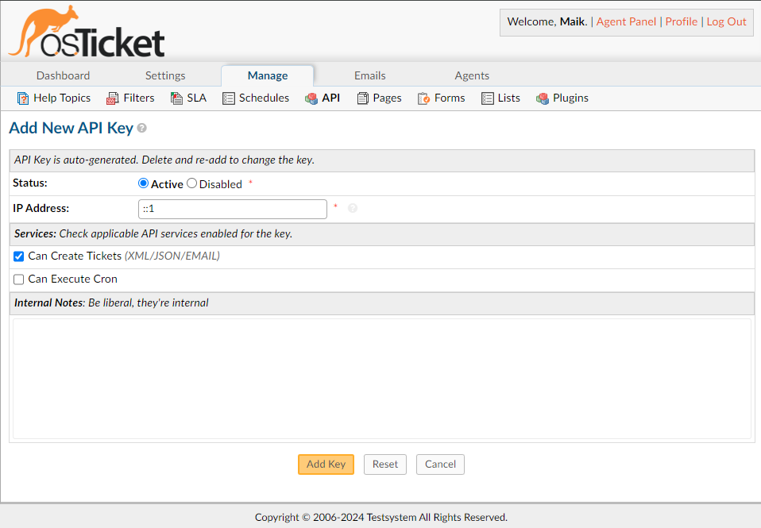
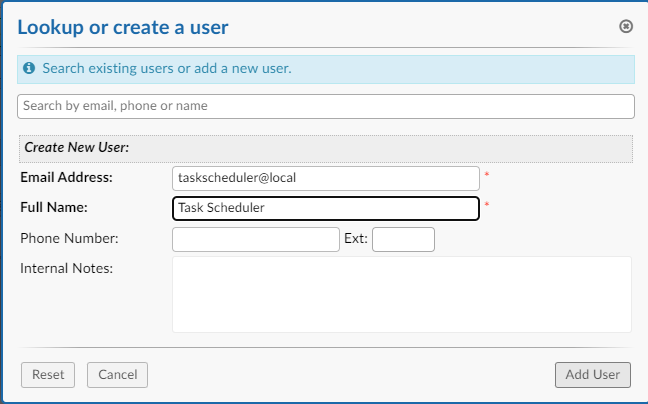

# Preparation

Before installing the Task Scheduler Plugin, please ensure your osTicket installation meets the following requirements:

## Requirements
- osTicket version 1.17 or higher.
- PHP 7.4 or higher.
- MySQL 5.7 or higher.

## Backup Your osTicket Database
It is highly recommended to backup your osTicket database before proceeding with the installation.

## Generate an API Key
1. Log in to the osTicket admin panel.
2. Navigate to `Admin Panel` > `Manage` > `API Keys`.
3. Click on `Add New API Key`.
4. Enter a name for the API key, enter the localhosts IP Address (127.0.0.1 for IPv4 / ::1 for IPv6), and assign ticket creation permissions.

## Create a User for Ticket Creation (Optional)
1. Navigate to `Agent Panel` > `Users` > `Add User`.
2. Fill in the details for the new user, ensuring the email and other required fields are completed.

# Continue with Step 2:
[Installation](02-Installation.md)
