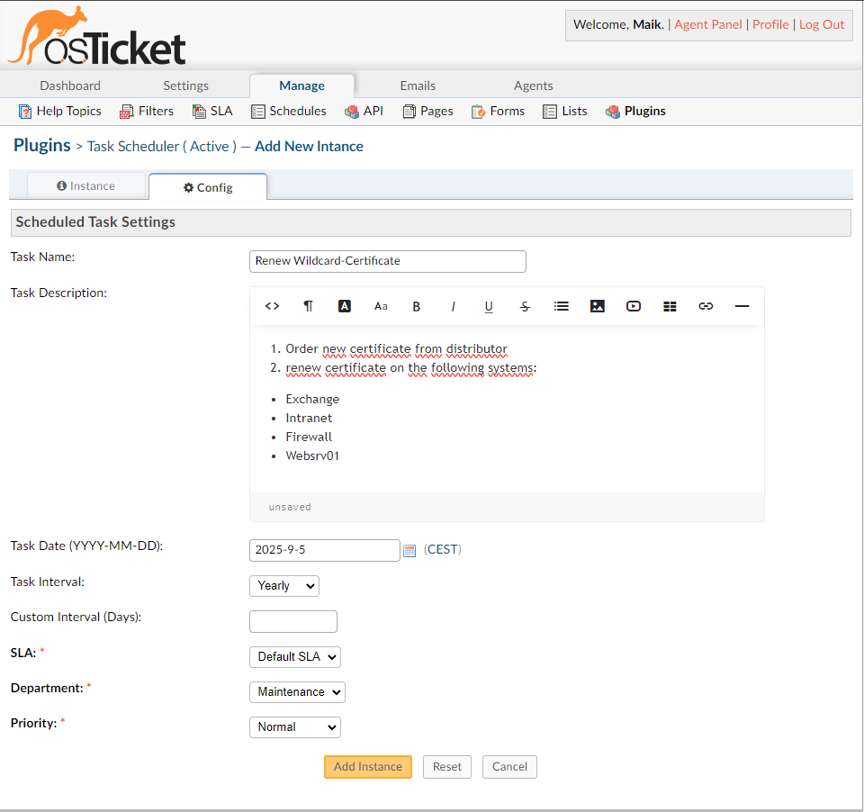

# Configuration

Configure scheduled tasks inside the plugin.

## General Guidance
The plugin is designed in a way, that scheduled tasks are configured inside an instance each.
So for each new scheduled task, you simply create a new instance.
The plugin observes an instances' status, meaning that disabling an instance will pause the creation of tickes for that specific instance.

## Instance Config

- Create a new instance inside the Task Scheduler plugin.
- Provide a name for the Instance (This isn't used by the plugin)
- Provide Internal notes (Optional - Also not used by the plugin)

### Scheduled Task Settings
- **Task Name**: Enter the title for the created ticket.
- **Task Description**: Enter the body (Initial Thread Entry) of the created ticket.
- **Task Date**: Set the date for the first ticket to be created.
- **Task Interval**: Choose the interval for a ticket to be created (daily, weekly, monthly, yearly, custom).
- **SLA**: Select the Service Level Agreement.
- **Department**: Select the department for the ticket.
- **Priority**: Set the priority level for the ticket.

### Custom Interval
If `Custom` interval is selected, specify the number of days.

# Continue with Step 4:
[Usage](04-Usage.md)