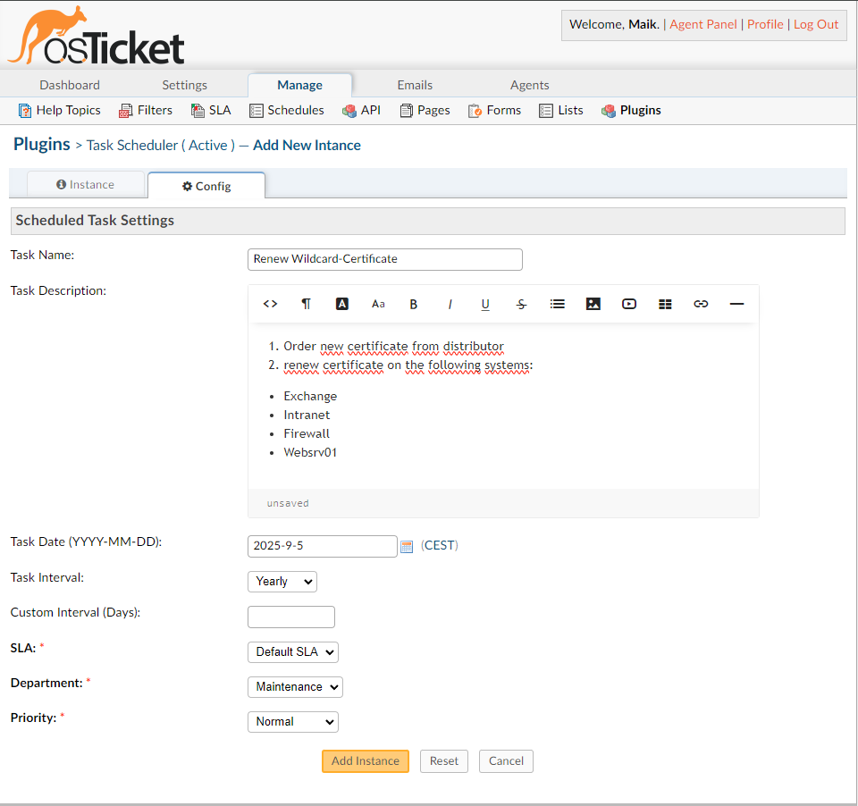

# Task Scheduler Plugin for osTicket

The Task Scheduler Plugin for osTicket is designed to automate the creation of recurring tickets based on a customizable schedule. This powerful tool helps streamline your workflow by ensuring that routine tasks and maintenance requests are automatically logged into your osTicket system, freeing up valuable time and resources.

## Features
- Automated Ticket Creation: Create tickets automatically based on a defined schedule.
- Flexible Scheduling: Supports daily, weekly, monthly, yearly, and custom intervals.
- Rich Text Support: Use the built-in rich text editor for detailed task descriptions.
- Customizable: Configure SLA, department, and priority for each scheduled task.
- Easy to Use: Simple configuration and setup process.

## Documentation
1. [Preparation](doc/01-Preparation.md)
2. [Installation](doc/02-Installation.md)
3. [Configuration](doc/03-Configuration.md)
4. [Usage](doc/04-Usage.md)

## Update
To update the plugin, simply copy any newer version over the existing one, overwriting everything in the process.
On releases, where a separate updating procedure is necessary, this will be explicitly stated in the release notes.

## Troubleshooting

- Ensure the plugin is enabled and correctly configured.
- Check the osTicket logs for any error messages.
- Verify the API key and URL settings.

Please do reach out about any issues with the plugin by creating an issue!